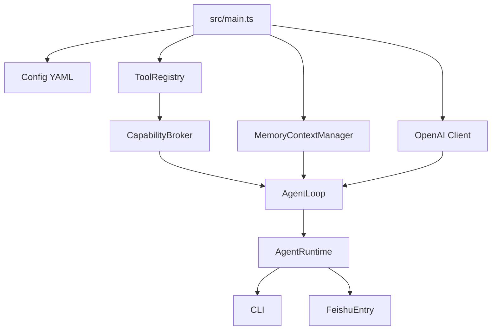

# AIGC-CLI

AIGC-CLI is a TypeScript-based local AI assistant runtime with persistent memory, tool calling, deep search, controlled command execution, and Feishu message ingress.  
AIGC-CLI 是一个 TypeScript 本地 AI 助手运行时，支持长期记忆、工具调用、深度搜索、受控命令执行与飞书消息入口。

> Formerly PrivateClaw. The runtime has been refactored to TypeScript under `src/`.  
> 原项目名 PrivateClaw；当前运行时已重构为 TypeScript，主实现位于 `src/`。

---

## Features / 功能特性

### English
- **Persistent Memory** via scoped `MEMORY.md` and daily logs in `memory/YYYY-MM-DD.md`.
- **Automatic Context Compression** when history becomes large.
- **Deep Search Workflow** with multi-round query planning, page reading, reflection, and summarization.
- **Controlled CLI Execution** through `exec_cli_command` with dangerous-command blocking.
- **Scheduled Execution** through `schedule_cli_command` (run command after a delay).
- **Feishu Single-Channel Ingress** via long connection in `src/main.ts`.
- **TypeScript Runtime** with strict type checking and build output in `dist/`.
- **Capability Foundation** for future subagents: profiles, execution context, broker, audit log, and tool registry.

### 中文
- 通过按用户范围隔离的 `MEMORY.md` 与 `memory/YYYY-MM-DD.md` 实现**持久记忆**。
- 当上下文过长时自动执行**历史压缩**。
- 提供**深度搜索流程**：多轮检索、页面读取、反思与总结。
- 提供**受控命令执行**：`exec_cli_command` 会拦截危险命令。
- 提供**定时执行能力**：`schedule_cli_command` 可在延迟后执行命令。
- 提供**飞书单通道接入**（长连接消息入口）。
- 使用 **TypeScript 严格类型检查**，构建产物输出到 `dist/`。
- 提供面向未来 subagent 的**权限地基**：profile、execution context、broker、audit log 与工具注册表。

---

## Runtime Design / 运行时设计



The current runtime keeps backward-compatible assistant behavior while routing tool visibility and execution through `CapabilityBroker`. This prepares the project for a reusable subagent model:

```text
SubAgent = same AgentLoop/Kernel + AgentProfile + narrowed ExecutionContext
```

当前运行时保持兼容助手行为，但工具可见性和工具执行已经统一经过 `CapabilityBroker`，为后续可复用 subagent 模型做准备：

```text
SubAgent = 同一套 AgentLoop/Kernel + AgentProfile + 收窄后的 ExecutionContext
```

---

## Project Structure / 项目结构

```text
.
├── package.json              # Node.js scripts and dependencies / Node 脚本与依赖
├── tsconfig.json             # TypeScript compiler config / TS 编译配置
├── src/
│   ├── main.ts               # Main entry (Feishu by default) / 主入口（默认飞书）
│   ├── agent-runtime.ts      # Runtime orchestration / 运行时编排
│   ├── channel-layer.ts      # Channel payload normalization / 渠道消息清洗层
│   ├── feishu-entry.ts       # Feishu long-connection ingress / 飞书长连接入口
│   ├── agent-loop.ts         # Unified AgentLoop planning/execution loop / 统一思考执行循环
│   ├── capabilities.ts       # Permission broker and execution context / 权限网关与执行上下文
│   ├── profiles.ts           # Agent profiles / Agent 权限画像
│   ├── tool-registry.ts      # Tool specs and capability mapping / 工具注册与权限映射
│   ├── deepsearch.ts         # Deep search workflow / 深度搜索流程
│   ├── context-memory.ts     # Memory manager / 记忆管理器
│   ├── tools.ts              # Tool implementations / 工具实现
│   ├── config.ts             # YAML config loading / 配置读取
│   └── skills/               # Skill scripts / 技能脚本
├── tool_config.yaml          # Tool schemas / 工具声明
├── dynamic_config.yaml       # Dynamic tool configs / 动态工具配置
├── personalization.yaml      # Model/API personalization / 个性化配置
├── requirement.md            # Setup notes / 安装说明
└── README.md
```

---

## Installation / 安装

### English
1. Use Node.js 20+.
2. Install dependencies:

```bash
npm install
```

3. Optional: install Playwright Chromium browser if your environment has not installed it yet:

```bash
npx playwright install chromium
```

4. Set API key:

```bash
export DASHSCOPE_API_KEY="your_api_key"
```

### 中文
1. 使用 Node.js 20+。
2. 安装依赖：

```bash
npm install
```

3. 如当前环境还没有安装 Playwright Chromium，可执行：

```bash
npx playwright install chromium
```

4. 配置 API Key：

```bash
export DASHSCOPE_API_KEY="你的key"
```

Windows PowerShell:

```powershell
$env:DASHSCOPE_API_KEY="你的key"
```

---

## Run / 运行

Set Feishu credentials and start the TypeScript runtime:

```bash
export LARK_APP_ID="your_app_id"
export LARK_APP_SECRET="your_app_secret"
npm run dev
```

Build and run compiled JavaScript:

```bash
npm run build
npm start
```

Windows PowerShell:

```powershell
$env:LARK_APP_ID="your_app_id"
$env:LARK_APP_SECRET="your_app_secret"
npm run dev
```

- Default entry is Feishu single-channel ingress.
- If you need local CLI mode temporarily: `MESSAGE_ENTRY=cli npm run dev`.

---

## Debug & Testing / 调试与测试

### English
- **Type check all TypeScript files**:

```bash
npm run typecheck
```

- **Build compiled runtime**:

```bash
npm run build
```

- **Run in local CLI mode for smoke testing**:

```bash
MESSAGE_ENTRY=cli npm run dev
```

- **Verify YAML configs are readable through the runtime**:

```bash
printf '/reset\nquit\n' | DASHSCOPE_API_KEY=dummy MESSAGE_ENTRY=cli npm run dev
```

### 中文
- **TypeScript 类型检查**：

```bash
npm run typecheck
```

- **构建运行时代码**：

```bash
npm run build
```

- **本地 CLI 模式冒烟测试**：

```bash
MESSAGE_ENTRY=cli npm run dev
```

- **通过运行时验证 YAML 配置可读**：

```bash
printf '/reset\nquit\n' | DASHSCOPE_API_KEY=dummy MESSAGE_ENTRY=cli npm run dev
```

---

## Tool: `exec_cli_command` / 命令执行工具

### English
- The agent decides whether command execution is needed.
- Dangerous commands (for example `rm`, `shutdown`, `mkfs`) are blocked.

### 中文
- 由 Agent 自主判断是否需要执行命令。
- 危险命令（例如 `rm`、`shutdown`、`mkfs`）会被拦截。

## Tool: `schedule_cli_command` / 定时命令工具

### English
- Use this when users ask to execute a command after a delay.
- Example intent: “Run `echo hello` after 30 seconds”.
- Dangerous commands are rejected automatically.

### 中文
- 当用户提出“过一段时间再执行命令”时使用。
- 示例意图：“30 秒后执行 `echo hello`”。
- 危险命令会被自动拒绝。

---

## Memory Files / 记忆文件

- `memory_scopes/<scope>/MEMORY.md`: stable preferences, rules, identity, and project conventions / 长期稳定偏好、规则、身份信息、项目约定。
- `memory_scopes/<scope>/memory/YYYY-MM-DD.md`: what was done today, temporary decisions, and active troubleshooting items / 今天做了什么、临时决定、正在排查的问题。

---

## Notes / 备注

- Keep API keys in environment variables; never hardcode secrets.  
  请将密钥保存在环境变量中，不要硬编码到仓库。
- This project is currently optimized for Feishu single-channel ingress.  
  当前项目主要面向飞书单通道消息接入场景。
- Personalized options are configured in `personalization.yaml` (API key env name, base URL, model choices).  
  个性化选项通过 `personalization.yaml` 配置（API Key 环境变量名、Base URL、模型选择）。
- See `TROUBLESHOOTING.md` for common non-retriable error signatures and stop conditions.  
  常见不可重试错误签名与自动停止条件见 `TROUBLESHOOTING.md`。
