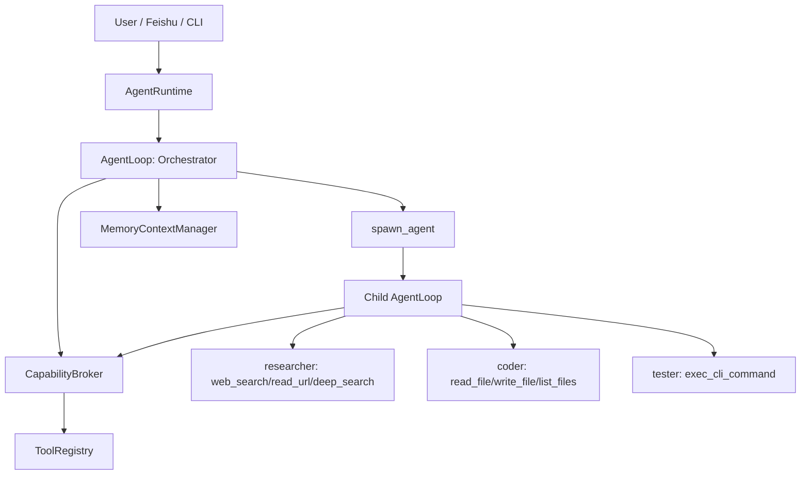

# NetAgent-CLI

NetAgent-CLI is a TypeScript runtime for building network-focused AI agents: web research, URL reading, deep search, controlled command execution, scoped memory, and Feishu/CLI ingress.  
NetAgent-CLI 是一个面向网络任务的 TypeScript Agent 运行时，聚焦网页研究、URL 读取、深度搜索、受控命令执行、隔离记忆以及飞书/CLI 接入。

> Formerly AIGC-CLI / PrivateClaw. The project is being reshaped around network-oriented agents and subagent permission isolation.  
> 原项目名 AIGC-CLI / PrivateClaw；当前方向是网络相关 Agent 与 subagent 权限隔离。

---

## What It Is / 项目定位

NetAgent-CLI is designed as a local-first network agent runtime:

- **Orchestrator-first**: the root agent plans and delegates instead of doing every side effect directly.
- **Network-oriented**: researcher subagents can search, read URLs, and run deep research flows.
- **Permission-scoped**: every tool call goes through `CapabilityBroker` before execution.
- **Composable subagents**: `researcher`, `coder`, and `tester` reuse the same AgentLoop with narrowed `ExecutionContext`.

NetAgent-CLI 的目标是本地优先的网络 Agent 运行时：

- **主控优先**：root agent 负责规划和委派，不直接执行所有副作用。
- **网络导向**：researcher subagent 可搜索、读取 URL、执行 deep research。
- **权限约束**：所有 tool call 执行前都经过 `CapabilityBroker` 裁决。
- **可组合 subagent**：`researcher`、`coder`、`tester` 复用同一套 AgentLoop，并使用收窄后的 `ExecutionContext`。

---

## Features / 功能特性

### English
- **Network Research** through `web_search`, `read_url`, and `deep_search`.
- **Subagent Runtime** via `spawn_agent` with `researcher` / `coder` / `tester` profiles.
- **Capability Broker** for tool allowlists, capability checks, resource scope checks, and audit logging.
- **Persistent Memory** via scoped `MEMORY.md` and daily logs in `memory/YYYY-MM-DD.md`.
- **Controlled CLI Execution** through `exec_cli_command` with dangerous-command blocking.
- **Feishu Single-Channel Ingress** via long connection in `src/main.ts`.
- **TypeScript Runtime** with strict type checking and build output in `dist/`.

### 中文
- 通过 `web_search`、`read_url`、`deep_search` 提供**网络研究能力**。
- 通过 `spawn_agent` 提供 **subagent 运行时**，支持 `researcher` / `coder` / `tester` profile。
- 通过 `CapabilityBroker` 统一做工具白名单、能力检查、资源范围检查与审计日志。
- 通过按用户范围隔离的 `MEMORY.md` 与 `memory/YYYY-MM-DD.md` 实现**持久记忆**。
- 提供**受控命令执行**：`exec_cli_command` 会拦截危险命令。
- 提供**飞书单通道接入**（长连接消息入口）。
- 使用 **TypeScript 严格类型检查**，构建产物输出到 `dist/`。

---

## Runtime Design / 运行时设计



Core data flow:

```text
RuntimeMessage
 -> Root Orchestrator ExecutionContext
 -> CapabilityBroker filters visible tools
 -> LLM tool_call: spawn_agent
 -> deriveChildContext(parent delegate ∩ child direct ∩ requested scope)
 -> Child AgentLoop
 -> CapabilityBroker filters/executes child tools
 -> Child result
 -> Orchestrator summary
 -> Memory
 -> RuntimeResult
```

核心数据流：

```text
RuntimeMessage
 -> Root Orchestrator ExecutionContext
 -> CapabilityBroker 过滤可见工具
 -> LLM tool_call: spawn_agent
 -> deriveChildContext(parent delegate ∩ child direct ∩ requested scope)
 -> Child AgentLoop
 -> CapabilityBroker 过滤/执行子 Agent 工具
 -> Child result
 -> Orchestrator 汇总
 -> Memory
 -> RuntimeResult
```

---

## Project Structure / 项目结构

```text
.
├── package.json              # Node.js scripts and dependencies / Node 脚本与依赖
├── tsconfig.json             # TypeScript compiler config / TS 编译配置
├── src/
│   ├── main.ts               # Main entry (Feishu by default) / 主入口（默认飞书）
│   ├── agent-runtime.ts      # Runtime orchestration / 运行时编排
│   ├── agent-loop.ts         # Plan / Execute / Observe loop / 统一思考执行循环
│   ├── capabilities.ts       # Permission broker and execution context / 权限网关与执行上下文
│   ├── profiles.ts           # Agent profiles / Agent 权限画像
│   ├── subagents.ts          # spawn_agent implementation / 子 Agent 委派实现
│   ├── tool-registry.ts      # Tool specs and capability mapping / 工具注册与权限映射
│   ├── tools.ts              # Tool implementations / 工具实现
│   ├── deepsearch.ts         # Deep search workflow / 深度搜索流程
│   ├── context-memory.ts     # Memory manager / 记忆管理器
│   ├── channel-layer.ts      # Channel payload normalization / 渠道消息清洗层
│   ├── feishu-entry.ts       # Feishu long-connection ingress / 飞书长连接入口
│   ├── config.ts             # YAML config loading / 配置读取
│   └── skills/               # Skill scripts / 技能脚本
├── tool_config.yaml          # Tool schemas / 工具声明
├── dynamic_config.yaml       # Dynamic tool configs / 动态工具配置
├── personalization.yaml      # Model/API personalization / 个性化配置
├── requirement.md            # Setup notes / 安装说明
└── README.md
```

---

## Installation / 安装

Use Node.js 20+:

```bash
npm install
```

Optional Playwright browser install for deep page reading:

```bash
npx playwright install chromium
```

Set API key:

```bash
export DASHSCOPE_API_KEY="your_api_key"
```

Windows PowerShell:

```powershell
$env:DASHSCOPE_API_KEY="your_api_key"
```

---

## Run / 运行

Feishu mode is the default:

```bash
export LARK_APP_ID="your_app_id"
export LARK_APP_SECRET="your_app_secret"
npm run dev
```

Local CLI mode:

```bash
MESSAGE_ENTRY=cli npm run dev
```

Build and run compiled JavaScript:

```bash
npm run build
npm start
```

---

## Debug & Testing / 调试与测试

```bash
npm run typecheck
npm run build
printf '/reset\nquit\n' | DASHSCOPE_API_KEY=dummy MESSAGE_ENTRY=cli npm run dev
```

---

## Permission Model / 权限模型

Subagent permissions are never expanded at runtime. They are derived as:

```text
child effective grants = parent delegate grants ∩ child profile direct grants ∩ requested task scope
```

子 Agent 权限不会在运行时扩大，派生规则是：

```text
child effective grants = 父级可委派权限 ∩ 子 profile 直接权限 ∩ 请求任务 scope
```

Current profiles:

| Profile | Purpose | Visible tools |
|---|---|---|
| `orchestrator` | Plan, delegate, summarize | `spawn_agent`, `get_system_time` |
| `researcher` | Network research | `web_search`, `read_url`, `deep_search` |
| `coder` | Scoped file edits | `read_file`, `write_file`, `list_files` |
| `tester` | Whitelisted checks | `exec_cli_command` |

---

## Memory Files / 记忆文件

- `memory_scopes/<scope>/MEMORY.md`: stable preferences, rules, identity, and project conventions / 长期稳定偏好、规则、身份信息、项目约定。
- `memory_scopes/<scope>/memory/YYYY-MM-DD.md`: daily dialogue and working memory / 每日对话与工作记忆。

---

## Notes / 备注

- Keep API keys in environment variables; never hardcode secrets.  
  请将密钥保存在环境变量中，不要硬编码到仓库。
- Personalized options are configured in `personalization.yaml`.  
  个性化选项通过 `personalization.yaml` 配置。
- Enable audit stdout with `AIGC_CLI_AUDIT_STDOUT=1`.  
  可通过 `AIGC_CLI_AUDIT_STDOUT=1` 打开审计日志输出。
